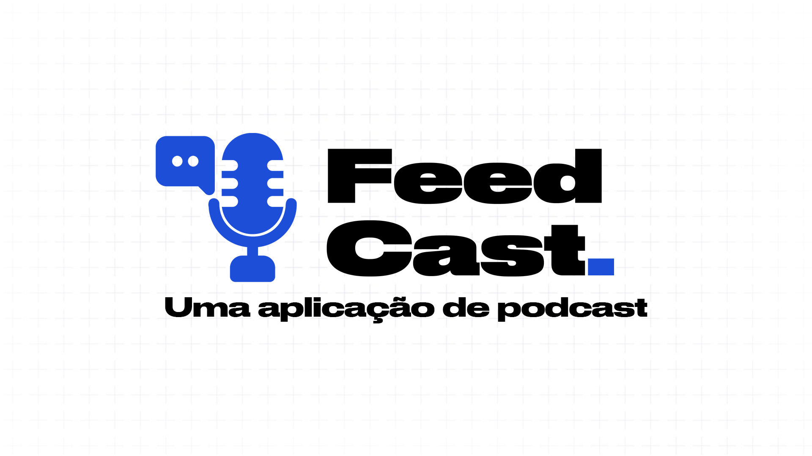

# FeedCast Front

Projeto desenvolvido como entrega da Sprint 1 da disciplina de Full-Stack Básico da Pós-Graduação em Engenharia de Software da PUC-Rio.



## Como executar

Essa aplicação foi pensada para funcionar em conjunto com uma API para prover os dados. Portanto você deverá utilizar o [backend desse projeto](https://github.com/odanilo/feedcast-api) para poder utilizá-la funcionando por completo.

Com a API rodando localmente, basta fazer o download/clone do projeto e abrir o arquivo `index.html` no seu browser.

Caso esteja rodando a API em outra URL, altere a variável `API_URL` do arquivo `script.js`:

```js
const API_URL = 'http://127.0.0.1:5000';
```

## Dados para utilizar para testar aplicação

### Feeds

Para testar a função de importação via feed `/importacoes/feed-rss` você pode usar os seguintes feeds:

- Não Inviabilize: https://anchor.fm/s/44064584/podcast/rss
- NerdCast: https://api.jovemnerd.com.br/feed-nerdcast/

### Episódios

Você pode usar as informações abaixo para fazer o teste relacionado aos endpoints de episódio:

```json
{
  "audio": "https://chrt.fm/track/GD6D57/https://nerdcast.jovemnerd.com.br/nerdcast_945_wow_20_anos.mp3",
  "capa": "https://uploads.jovemnerd.com.br/wp-content/uploads/2024/08/nc945_wow_20_anos_3000x3000px__1u8q1j8.jpg",
  "descricao": "Pela Aliança ou pela Horda?",
  "titulo": "NerdCast 945 - World of Warcraft: 20 anos de jogatina"
}
```

```json
{
  "audio": "https://chrt.fm/track/GD6D57/https://nerdcast.jovemnerd.com.br/nerdcast_944_houseofdragon2.mp3",
  "capa": "https://uploads.jovemnerd.com.br/wp-content/uploads/2024/08/nc944_house_dragon_2_3000x3000px__i047ve.jpg",
  "descricao": "De que lado você está?",
  "titulo": "NerdCast 944 - House of the Dragon: dancem, dragões, dancem!"
}
```
